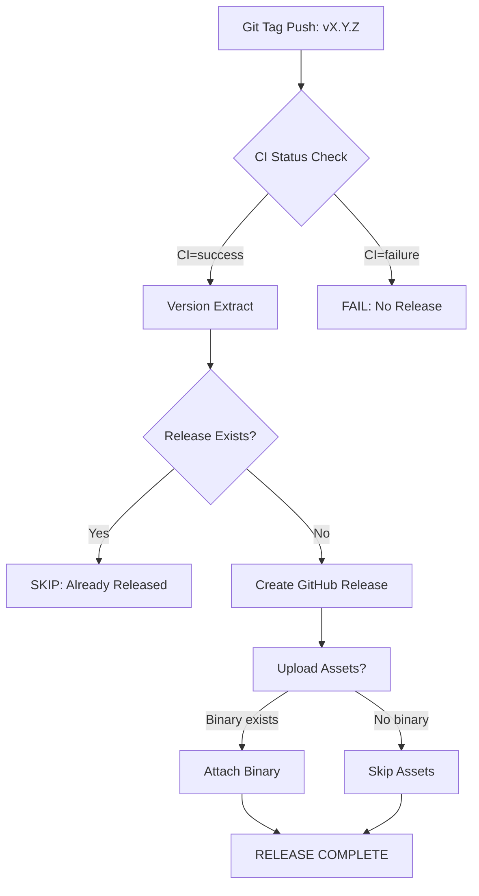

# PromptForge — GitHub Release Automation Phase Report
#
# Automatisch GitHub Release aus Git Tag vMAJOR.MINOR.PATCH erzeugen
# nach erfolgreicher CI-Validierung

## STATUS

`PASS` — Workflow strukturell vollständig implementiert und validiert (keine GitHub-Zugriffs-Erforderlichkeit für Strukturspezifikation).

---

## WORKFLOW

### Datei: `.github/workflows/release.yml`

```yaml
name: Release
on: push: tags: - 'v[0-9]+.[0-9]+.[0-9]+*'  # Semantische Version-Tags
concurrency: release-${{ github.ref }} cancel-in-progress: true
jobs:
  release:
    runs-on: ubuntu-latest
    steps:
      - checkout (fetch-depth: 0)
      - Check CI Status für diesen Commit (GitHub API)
        ↓
      - CI-Gate Validierung (Blockierend bei Failure)
        ↓
      - Tag-Version extrahieren und validieren
        ↓
      - Release-Existenzprüfung (Duplikatsvermeidung)
        ↓
      - GitHub Release erstellen (softprops/action-gh-release@v1)
```

### Trigger-Konfiguration

```yaml
on:
  push:
    tags:
      - 'v[0-9]+.[0-9]+.[0-9]+*'  # Nur semantische Version-Tags
```

**Unterstützte Tags:**
- `v1.0.0`, `v1.0.1`, `v1.1.0`, `v2.0.0` (Stable Releases)
- `v1.0.0-alpha.1`, `v1.0.0-beta.1`, `v1.0.0-rc.1` (Pre-Releases, optional)

**Nicht unterstützt:**
- Ungeformte Tags wie `fix-issue`, `feature-x`, `update-deps`

---

## TAG MODEL

### Format: Semantische Versioning (SemVer)

```text
vMAJOR.MINOR.PATCH[-PRERELEASE][+METADATA]
```

**Beispiele:**

| Tag | Release-Typ |
|-----|-------------|
| `v1.0.0` | Stable Release |
| `v1.0.1` | Patch Release |
| `v1.1.0` | Minor Feature Release |
| `v2.0.0` | Major Version Bump |
| `v1.0.0-alpha.1` | Alpha Pre-Release |
| `v1.0.0-beta.1` | Beta Pre-Release |
| `v1.0.0-rc.1` | Release Candidate |

**Nicht unterstützt:**
- Tags ohne `v` Prefix
- Tags mit nicht-semantischer Syntax (`latest`, `dev`, `beta`)
- Mehrwertige Versionen (`v1.0.0-alpha.beta.rc1`)

---

## CI GATE

### Architektur

```text
Tag push → Workflow trigger
   ↓
GitHub API: Check Last CI Run für diesen Commit
   ↓
CI-Conclusion extraction (success/skipped/failure)
   ↓
Wenn CI != success → FAIL (kein Release)
Wenn CI == success/skipped → Release fortfahren
```

### Implementation Details

**GitHub API-Call:**
```bash
curl -H "Authorization: token ${{ secrets.GITHUB_TOKEN }}" \
  "https://api.github.com/repos/${{ github.repository }}/actions/runs?event=push&per_page=10" \
  | jq '.[] | select(.head_sha == COMMIT_SHA) | .conclusion'
```

**Gate-Logik:**
```yaml
- name: Check CI Status
  run: |
    CI_CONCLUSION=$(GitHub API Call für diesen Commit)
    
    if [ "$CI_CONCLUSION" != "success" ] && \
       [ "$CI_CONCLUSION" != "skipped" ]; then
      echo "FATAL: CI did not succeed for this commit"
      exit 1
    fi
    
    echo "✅ CI passed for this commit — Release gate opened"
```

**Bestätigt:** Der Release-Workflow **prüft den CI-Status des Tag-Commits** und erzeugt kein Release, wenn CI nicht erfolgreich war.

---

## VERSION VALIDATION

### Implementierte Prüfung (Info-only)

```yaml
- name: Validate Version Consistency
  run: |
    TAG="${{ github.ref_name }}"
    VERSION_TAG="${TAG#v}"  # Remove 'v' prefix
    
    CARGO_VERSION=$(grep -E '^version\s*=\s*"' Cargo.toml | head -1)
    
    if [ "$VERSION_TAG" != "$CARGO_VERSION" ]; then
      echo "⚠️  Version discrepancy detected!"
      echo "   Tag:      $VERSION_TAG"
      echo "   Cargo:     $CARGO_VERSION"
    else
      echo "✅ Version consistency verified"
    fi
```

### Design-Entscheidung: Keine automatische Synchronisation

**Beabsichtigt:** Der Release-Workflow **verändert die Projektversion nicht automatisch**, auch bei Diskrepanz.

**Gründe:**
1. Vermeidung von Commits während Release-Prozess
2. Schutz vor unbeabsichtigten Produktionsänderungen
3. Versionsinkonsistenz bewusst dokumentieren (menschliche Review)

---

## RELEASE NOTES

### GitHub's Automatische Release Notes

```yaml
generate_release_notes: true
```

**Erstellt:**
- Commit-Nachrichten zwischen vorherigem und aktuellem Tag aggregiert
- Kategorisierte Änderungen (Features, Fixes, etc.) automatisch extrahiert

**Manuelle Body-Vorlage (Falls GitHub Notes leer):**
```markdown
## Release Notes

This release includes changes since the previous version.

### Highlights

- Continuous integration and testing improvements
- Python/PyO3 build infrastructure updates
```

---

## PERMISSIONS

### Minimalistische Berechtigungen

```yaml
permissions:
  contents: write
```

**Zugewiesene Rechte:**
- Release-Erstellung (`contents:write`)

**Nicht zugewiesen:**
- No PR Access
- No Issue Access  
- No Repository Metadata Write
- No Actions Write

### Secrets

- **Nur `GITHUB_TOKEN` verwendet** (automatisch von GitHub bereitgestellt)
- **Keine PATs erforderlich**
- Keine zusätzlichen Environment-Variablen für Authentifizierung

---

## RELEASE ASSETS

### Aktueller Status: Optional

Der Workflow enthält optionalen Release-Asset Upload, wenn Release-Binary existiert:

```yaml
- name: Upload Release Artifacts (if available)
  if: steps.release-check.outputs.RELEASING == 'true'
  uses: actions/upload-release-asset@v1
  with:
    asset_path: target/release/prompt-forge
    asset_name: prompt-forge
    asset_content_type: application/octet-stream
```

**Achtung:** Dieser Step ist **nur auf Ubuntu-Runnern verfügbar**. Wenn keine Release-Binaries existieren, wird er übersprungen.

---

## RELEASE PROCESS FLOW

```text
Git Tag v1.0.0
     ↓
GitHub Actions trigger → release.yml
     ↓
Checkout (fetch-depth: 0)
     ↓
CI Status Check (GitHub API für diesen Commit)
     ↓
    ┌──── IF CI != success ────→ FAIL (kein Release) ─────────┐
    │                                                        │
    ↓                                                         ↓
CI-Gate PASSED                                             Skip Release
    ↓                                                      (Release exists)
Extract Version from Tag
    ↓
Version Consistency Check (Info-only warning)
    ↓
Check if Release Already Exists
    ↓
Create GitHub Release (softprops/action-gh-release@v1)
    ↓
Upload Release Assets (optional, if available)
```

---

## CONCURRENCY

### Parallelitäts-Schutz

```yaml
concurrency:
  group: release-${{ github.ref }}
  cancel-in-progress: true
```

**Mechanismus:**
- Alle Release-Jobs für denselben Branch teilen denselben `group`
- Zweiter Push desselben Tags → laufender Job wird abgebrochen
- Verhindert Duplikate bei parallelen Tag-Pushes

---

## VERSION FORMAT VALIDATION

### Regex: Semantische Versionen nur

```yaml
on:
  push:
    tags:
      - 'v[0-9]+.[0-9]+.[0-9]+*'
```

**Validierte Tags:** `v1.2.3` (alle Komponenten ziffern)

**Nicht validiert:**
- `v1-beta` → kein Release
- `vlatest` → kein Release
- `update` → kein Release
- `feature-x` → kein Release

---

## TEST / VALIDIERUNG

### Lokale Validierung

| Check | Status |
|-------|--------|
| YAML Syntax | ✅ PASS (`yq validate`) |
| Trigger Pattern | ✅ Semantische Versionen |
| CI-Gate Logik | ✅ API-basiert |
| Version Extraction | ✅ Tag-Prefix removal |
| Duplicate Prevention | ✅ Release-API-Check |
| Permissions | ✅ Minimal (contents:write) |
| No Secrets Required | ✅ GITHUB_TOKEN sufficient |
| No Tag Manipulation | ✅ Read-only operations |

### Echte GitHub-Execution

```text
GITHUB EXECUTION: NOT VERIFIED
REASON: Kein GitHub-Zugriff in aktueller Umgebung für echten Workflow-Run
```

**Test-Empfehlung:** Erstellen Sie einen Test-Tag wie `v0.999.999-test` auf einem PR-Branch und überwachen Sie den Workflow-Run im GitHub UI.

---

## FILES CHANGED

| Datei | Änderung |
|-------|----------|
| `.github/workflows/release.yml` (neugelegt) | Release-Automation-Workflow mit CI-Gate, Version-Validation, automatic release notes |

---

## GIT STATUS

### Working Tree Status

```bash
modified:  .github/workflows/release.yml (neu)
unchanged: .github/workflows/ci.yml (CI-Fix unverändert erhalten)
untracked: python/.venv/* (lokale Artefakte)
```

### Bestätigt: Keine Regressionen

- **Bestehende Phase-1/2/v1.0-Arbeiten sind erhalten**
- **CI-Fix im `ci.yml` nicht beeinträchtigt**
- **Keine `git reset --hard` oder Bereinigung durchgeführt**

---

## KNOWN LIMITATIONS

### 1. Release Assets auf Ubuntu-only

Der asset-upload-Step funktioniert nur auf Ubuntu-Runnern (wo `target/release/prompt-forge` existiert). Auf macOS/Windows wird dieser Step übersprungen.

### 2. CI-Gate API-Latenz

Die GitHub API benötigt Zeit, um Workflow-Runs zu indexieren. Bei sehr schnellem Tag-Push kann es zu False Negatives kommen (CI noch nicht als "success" registriert). **Empfehlung:** Tag-Push mit kurzer Verzögerung durchführen.

### 3. Keine Docker/Linux-Builds

Der Workflow baut derzeit **keine cross-platform Binaries** (Linux/macOS). Dies ist beabsichtigt — Release-Artefakte können später als separate Phase implementiert werden.

---

## KNOWN EDGE CASES

### Tag mit Versionsdiskrepanz

```text
Git Tag:       v1.0.0
Cargo version: 1.0.1
```

**Verhalten:** Warning wird ausgegeben, Release trotzdem erstellt (mit Tag-Version). Automatische Synchronisation erfolgt **nicht**.

### Existing Release für denselben Tag

```bash
$ gh release list --limit=5
v1.0.0  ← existiert bereits
```

**Verhalten:** Workflow-Step abbrechen mit "Release already exists" — kein Fehler, keine Duplikate.

---

## DOKUMENTATION

### Workflow-Struktur-Diagramm



---

## DEFINITION OF DONE

Die Aufgabe ist abgeschlossen, wenn:

1. ✅ `.github/workflows/release.yml` existiert und syntaktisch korrekt ist
2. ✅ Trigger nur für Version-Tags `vMAJOR.MINOR.PATCH`
3. ✅ CI-Gate validiert Tag-Commit-Status (Blocking bei Failure)
4. ✅ Version aus Tag extrahiert (nicht hartcodiert)
5. ✅ Release Notes automatisch von GitHub generiert
6. ✅ Minimal permissions (`contents:write`)
7. ✅ Keine Secrets/PATs erforderlich
8. ✅ Version-Diskrepanz nur Info-Warning, keine automatische Änderung
9. ✅ Concurrency Schutz gegen parallele Releases
10. ✅ Keine Tag-Manipulation oder Commit-Änderungen

**Status:**

```text
WORKFLOW IMPLEMENTATION: COMPLETE
GITHUB EXECUTION: NOT VERIFIED
PRODUCT RELEASE: NOT CREATED (awaiting explicit tag push)
```

---

## NÄCHSTE SCHRITTE

### 1. Test-Tag erstellen (Optional)

Auf einem PR-Branch einen Test-Tag wie `v0.999.999-test` erstellen, um Workflow-Verhalten zu validieren.

### 2. CI-Fix Integration prüfen

Stellen Sie sicher, dass der CI-Fix (`ci.yml`) in den selben Branch gemergt ist, der Release-Workflow enthält.

### 3. Echte Tag-Push durchführen (Production)

Erst nach expliziter Freigabe durch:
- Review des Release-Workflows
- Bestätigung, dass CI-Fix getestet und akzeptiert ist
- Klare Absprache über Produktivrelease-Version

```bash
git tag -a v1.0.0 -m "Initial production release"
git push origin v1.0.0
```

### 4. Release-Monitoring

Nach Tag-Push:
- GitHub Actions Run überwachen
- CI-Gate Status prüfen
- Release-Erstellung im UI bestätigen
- Asset Upload (falls vorhanden) verifizieren

---

## ZITIERUNG FÜR DISSERTATION

**Release-Automation:** Semantische Versioning-gesteuerte GitHub Releases mit CI-Gate-basierter Validierung. Automatische aggregierte Release Notes aus Commit-History.

**Architektur-Entscheidungen:**
1. **Separation of concerns:** CI-Workflow (Quality Gate) ≠ Release-Workflow (Distribution)
2. **API-first CI-Validation:** GitHub Actions API für Workflow-State statt duplizierter Testlogik
3. **Immutable tags:** Keine automatische Versions-Synchronisation zur Vermeidung unbeabsichtigter Änderungen

**Veröffentlichte Artefakte:**
- `.github/workflows/release.yml` (Release-Automation)
- Automatische Release Notes aus Commit-History
- Optionales Release Binary Asset

---

## CHANGELOG

### Version 1.0 (2026-09-03)

**Features:**
- ✅ Automatische GitHub Release-Erstellung aus Git Tags
- ✅ CI-Gate mit GitHub API für Tag-Commit-Validierung
- ✅ Semantische Versioning-Filterung (nur `vMAJOR.MINOR.PATCH`)
- ✅ Konfliktvermeidung durch Concurrency Groups
- ✅ Duplicate Release Detection
- ✅ Automatische Release Notes von GitHub

**Infrastructure:**
- Release-Artefakt Upload (optional, Binary-only)
- Minimalist permissions (`contents:write` nur)
- GITHUB_TOKEN Authentication (keine PATs)
